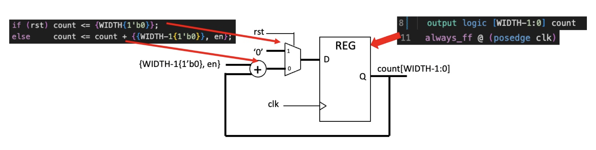

## Task 1 - Simulating a basic 8-bit binary counter

# Background

**System Verilog** is a hardware description and verification language (HDL) mostly for designing digital hardware, based in verilog. HDL specifies the logic functions and programmes based around the hardware.

**Verilator** is a software package to simulate Verilog/SV designs. 
- They are *cycle-accurate*
  - circuit states are only evaluated once in a clock cycle
  - State can only be true (1) or (0)
  - It cannot be an unknown, high impedance, floating, or in any oher signal states
  - It doesn't evaluate time within a clock cycle; only suitable for functional verification with no timing information
- Verilator verified design is guaranteed to be synthesisable by modern logic synthesis tools
  - e.g. Verilator cannot evaluate glitches in a circuit

Verilator is extremely fast as it translates Verilog/SV into C++ (or System C) code. It then uses the highly efficient C++ compiler to produce a DUT (Device under Test) - this is a natively executable 'model' or program of the design.

The **Vbuddy** was created to provide a bridge between the Verilator simulator and the actual physical electronics (microphone signal, 7-segment displays).

For this module, we also learnt a particular level of abstraction of the processor hardware known as RTL (Register Transfer Level). In RTL specificiation, all combinational logic are sandwiched between registers controlled by a clock signal/s.

This is done through encoding modules - they can either be Behavioural which describes what the module does, or Structural which decides how the module is built.

## Objective of the Task

Objective of this task is to write a basic testbench in C++ to verify the counter works, make an executable model of the counter and testbench using GTKwave to examine the waveforms.

Each Lab, we are expected to fork the repository and then download it onto our local disc.

# Step 3: System Verilog File

- This counts on the positive edge of the clk if the enable is '1'. It synchronously resets to 0 is rst is asserted.
- This is a *behavioural module*. The code will assign the name counter to the module, and allow us to describe the abstract functional behaviour rather than the structural side of things.
  - the module and file name must be the same
  - Instantiate the module
    - every time we use this module in SV, we 'clone' a separate identity
    - this clone has a separate existence
    - SV is entirely hierarchal
    - modules can instantiate other models
    - every module has inputs and outputs as above

I created a new system verilog file (counter.sv) and entered the following code.

- *en* is set to 0/1, and only works when set to 1
- *rst* we will reset counter at the positive clk edge
- The *always_ff@ (posedge clk)* the ff command is used without a posedge reset, therefore the ff was synchronous (only reset on the positive clk egde)
- System Verilator uses idioms to describe flip flops. The “always” followed by @(posedge clk) means that when any signal in the posedge of the clock is asserted, “count” is executed.
- ‘<=’ in line 12 and 13 are non-block assignments which should be used within an always_ff block.
- {WIDTH{1’b0}} in line 12 uses the concatenation operator { } to form WIDTH bits of ‘0’, which will then form a 7 bit output of value 0.
- The 8 bit number is is formed by carrying out bitwise manipulation and concatenation: {WIDTH-1{1'b0}, en}. The WIDTH - 1 means the most significant 7 bits is set to 0. The LSB = enable value. When enable value is high (1) the counter increments, otherwise (0) the counter is unchanged.

The bits are assigned and concatinated as follows:

# Step 4: Creating a testbench

The testbench is a 'wrapper' for the module counter (which is the DUT)
  - it produces the input stimuli to the DUT, receives the signals and help user determine if its doing what it's supposed to do

The testbench file has a standard structure with different sections
- If the module is called counter, a header file 'Vcounter.h' is produced, which defines the interface signals for this module
  - *Verilated.h* must ALWAYS be included
  - For a trace file, *verilated_vcd_c.h* must also be included
- Next section declares internal variables (NOT SIGNALS) for the testbench
  - here, i counts no. of clk cycles, where clk is another internal variable
- *Line 11* is the statement which instantiates the module (DUT)
  - if the module is called 'encoder' then the line will be **Vencoder* top = new Vencoder;**
  - this segment is always the same for all testbenches
    - tells Verilator to produce the trace file to inspect later
- Next section initiliases the state of all the input signals before clocking the circuit
  - top here is a pointer pointing to a strucutre that has all the input and output signals
  - represents top level entry; only these are visible

## Step 5: Compiling
I then compiled the SV model with the tesbench file using the *doit.sh* file

## Step 6: Output Waveform

I ran GTKwave to see the waveform of my counter

We can see that the eval() function comes after the clk line. This means all the evaluations occur "during the clock cycle" but that does not show up until the positive edge of the next clock cycle in the waveform on GTK. So if rst is to be 0 when i == 2. This means at positive edge of clock cycle 2, rst is still 1. During this clock cycle the eval function occurs and rst changes. However this change is displayed at the positive edge of clock cycle 3.

CLK: The clock cycles Count: The output of modules, goes back to 0 at reset, when enable is high at each postive edge will increment by 1 until it goes over 8 bit value. Enable: When high activates clock, when low pauses counter. Reset: When high, in next cycle the clock will go back to 0.

Since Verilator is cycle-by-cycle simulator, the time axis has no significance. Each clock tick (i.e. half a clock cycle) is display as 1ps(silly). The states that the circuit goes through are accurate. The counter output count[7:0] shows values that is incrementing one every clock cycle. The effect of rst and en signals can also be observed.

## Challenge
1) Modify the testbench so that you stop counting for 3 cycles once the counter reaches 0x9, and then resume counting. You may also need to change the stimulus for rst.

Make these modification, compile, and run. Examine the waveform with GTKwave and explain what you see.

I changed the code as above. This led to the following clock signal:

2) The current counter has a synchronous reset. To implement asynchronous reset, you can change line 11 of counter.sv to detect change in rst signal.

The current counter has a synchronous reset. To implement the asyncrhronou reset, we can change line 11 of counter.sv to detect a change in the *rst* signal

This led to the following wave output:

