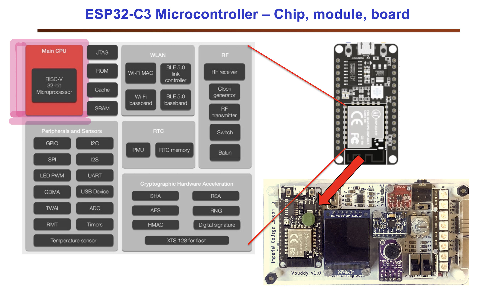
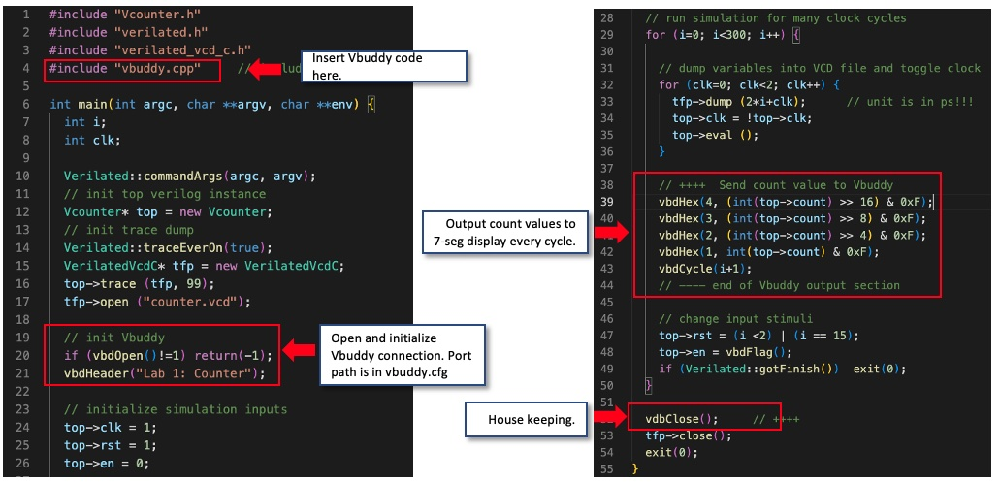
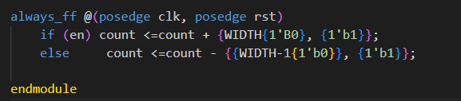

## Task 2: Linking Verilator simulation with Vbuddy
In this task, you will learn how to modify the testbench to interface with the Vbuddy board. 

# Step 1
- Move counter.sv and counter_tb.cpp into task 2 folder
- Make a copy of the files Vbuddy.cpp and Vbuddy.cfg from your Lab 1 folder to put into task 2 folder.
- Connect Vbuddy using *~/Documents/iac/lab0-devtools/tools/attach_usb.sh*
- Enter *ls /dev/tty.u* in terminal
- Get output: */dev/tty.usbserial-110*

# Step 2: Modify the testbench 
I modified the code as follows:

- The output is inputted into 4 vbdHex functions
  - this produces the 4 counter displays which will visually represent the counter in HEX form
- The 1st input represents the index of each display
- The input top ->count represents the output value from the counter
- Top count is a 32 bit number. By setting the conditon >> 16 this represents a 16 bit shift this drops will drop the least significant bits. 
  - The same is done with each display so that once you pass a certain number the counter moves to the next display index.
- Finally we have a bitwise and with 0xFF to remove additional 0's, produced from shifting.
  - “& 0xff” effectively masks the variable so it leaves only the value in the last 4 bits, and ignores all the rest of the bits.
  - The int type is included to avoid error but unnnessecary, in case in different variable type.

# Step 3: Explore the flag feature on Vbuddy
Vbuddy's rotary encoder has a push-button switch. Vbuddy keeps an internal flag which, by default, will toggle between ‘0’ and ‘1’ each time the button is pressed.

You can interrogate this toggle switch state with vbdFlag();, which will return its current state and then toggle. A little postbox showing the flag state is drawn in the footer of the TFT display.

I changed the tb code on line 48 as follows:

*top->en = vbdFlag();*

This outputted a counter on 7-segment display where the Vbuddy was counting up.

To show the output more cleary, I plotted the output on the TFT by replacing this with the following command:

*vbdPlot(int(top->count), 0, 255);*

I also increased the number of clock cycles as it plots much quicker. I was also able to start/stop the counter with the flag.

# Challenge: Modify your counter and testbench files so that the en signal controls the direction of counting: ‘1’ for up and ‘0’ for down, via the vbdFlag() function.

I modified my code as follows:

I edited the logic for the enable - if enable is high the counter adds 1 bit, and if its low then the counter will subtract 1 bit each clock cycle.

