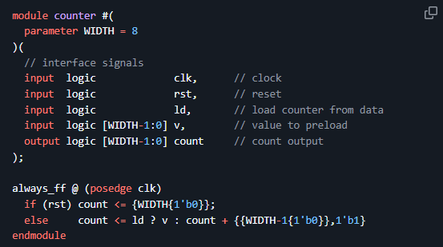
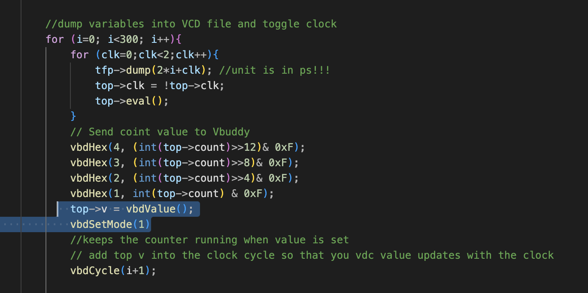
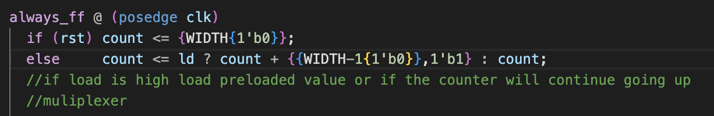

## Task 3: Vbuddy parameter & flag in one-shot mode

The rotary encodes (EC11) provides input from Vbuddy to the Verilator simulation model. 
  - Turning the encoder changes a stored parameter value on Vbuddy independently from the Verilator simulation. - This parameter value can be read using the vbdValue( ) function, and is displayed on the bottom left corner of the TFT screen in both decimal and hexadecimal format.

# Step 1: Loadable Counter

Vbuddy’s flag register has two modes of operation. The default mode is TOGGLE, which means that everything the rotary encoder switch is pressed, the flag will toggle as indicated at the bottom of the TFT screen.

However, using the vbdSetMode(1) function, you can set the mode to ONE-SHOT behaviour. 

Whenever the switch is pressed, the flag register is set to ‘1’ as before – now the flag is “ARMED” ready to fire. However, when the flag register is read, it immediate resets to ‘0’.

We modified the *counter.sv* file as below. This replaces the *en* with a load signal *ld*
 - when *ld* is asserted, the value *v* is loaded into the counter as a preset value.

I also modified the testbench as follows:

The modified testbench removes enable and replaces it with *v->VdbValue()* and *lb->flag* so that when the button is pressed the flag and therefore *lb* is high instianting the *VdbValue* to be set in place of the counter, using the *vbdSetMode(1)* function within the for loop this allows the counter to keep counting after the button has been preesed and value is set.

*VdbSetMode(0)*: default, click once to set counter to *VdbValue()* and click again to activate counter.

*VdbSetMode(1)*: once clicked the vdbvalue will be set and then *ld* will immediately go down so that the counter continues counting, without the need to press the rotary button again.

With *VbdSetMode(1)*, you can set the mode to ONE-SHOT behaviour. Whenever the switch is pressed, the flag register is set to ‘1’ as before – now the flag is “ARMED” ready to fire. However, when the flag register is read, it immediate resets to ‘0’, this acts as a reset back to zero so it counts as though lb= 0

# Step 2
Using the one-shot behaviour of the Vbuddy flag, it is possible to provide one clock pulse each time you press the rotary encoder switch. In other words, you can single step the counting action.

I used one shot so that lb is high. This means the counter will increment but then is instantly set to the current value and not change till the button is pressed again.

