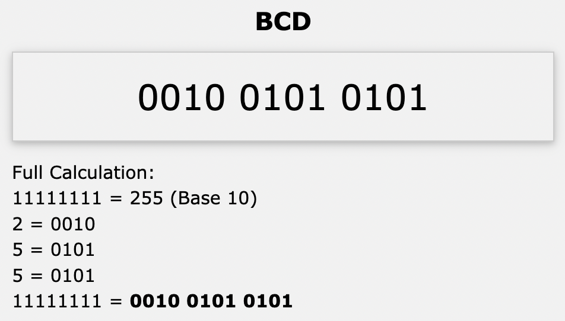
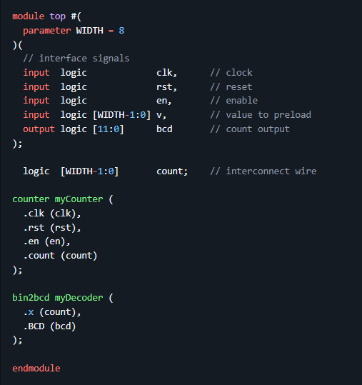
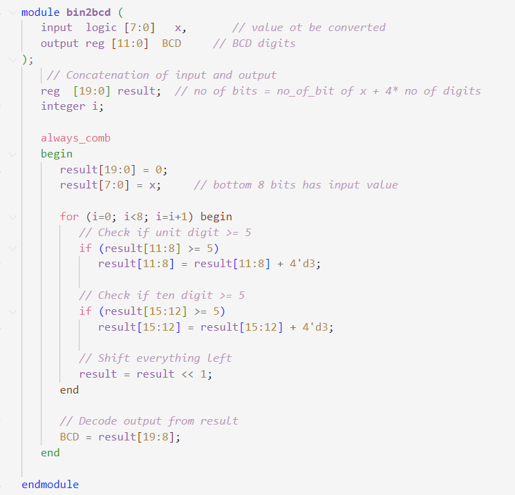

## Task 4: Displaying count as BCD numbers

In this task I had to take the output from the counter 
(an 8-bit binary counter) and convert it into three BCD digits.

**Why 3**
BCD is where 4-bit binary numbers are used to represent a decimal digit. This wastes bit because a 4-bit number can represent 16 digits, even though a decimal only has 10 digits.

Ideally an 8-bit number would produce a 2 digit BCD. However, if the binary number exceeds 1001, we get an overflow into the 3rd BCD digit.

I copied the following code into *top.sv*:

This is the following code from the *bin2bcd.sv*:

Following this, I copied in the *doit.sh* file from the previous task and ran the code.

insert output.

